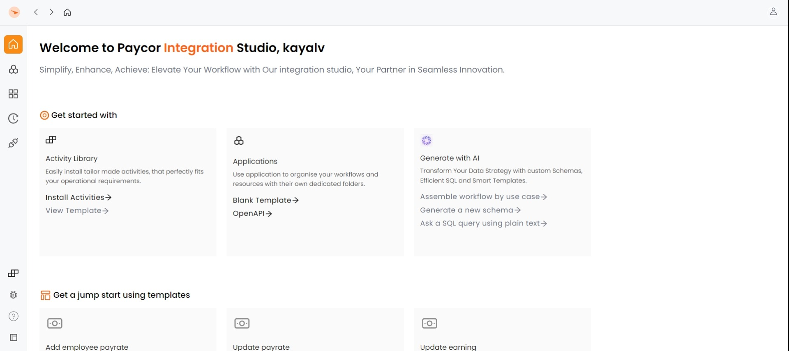

# Create an Application Using OpenAPI

1. Navigate to the homepage and  select **"Open API"** under the **"Applications"** section .

<figure><figcaption></figcaption></figure>

The Create new application page displays.

<figure><figcaption></figcaption></figure>

3\. In the **Add Details** section

Enter Application Details: Name your application, provide a description, assign a version, select the suitable type for your use case, and add relevant tags.

<figure><figcaption></figcaption></figure>

4. In the **Upload Specification** section

<figure><figcaption></figcaption></figure>

* You can either paste the link or drag/drop the file (OpenAPI or YAML format) to upload OpenAPI specification.&#x20;
* After uploading, proceed by clicking the '**Next**' button.

5. In the **Choose Endpoints** section

* Choose specific endpoints from the listed options and click the '**Create**' button.

Upon completion, a workflow is automatically generated and displayed on the application workspace page.

<figure><figcaption></figcaption></figure>
